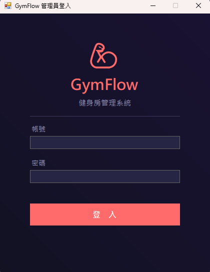
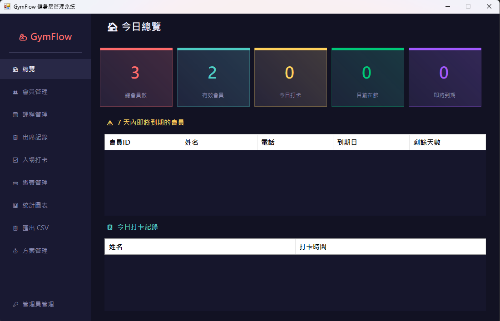

# GymFlow 健身房管理系統
視窗程式設計 (II) 期末專題

## 專案簡介

GymFlow 是一套功能完整的健身房管理系統，提供會員管理、課程安排、入場打卡、繳費記錄等功能，並附有統計圖表與資料匯出功能。系統採用 XML 檔案儲存資料，不需安裝任何資料庫軟體即可執行。

## 功能介紹

- 管理員登入：帳號密碼驗證，支援新增多位管理員
- 總覽 Dashboard：即時顯示總會員數、有效會員、今日打卡、目前在館人數、即將到期會員
- 會員管理：新增、編輯、刪除、搜尋會員，可查看每位會員的繳費、打卡、課程歷史記錄
- 課程管理：新增課程、會員報名與取消報名，支援姓名搜尋
- 出席記錄：記錄每堂課的出席會員，可搜尋姓名後勾選
- 入場與退場打卡：輸入姓名即可打卡，自動驗證會籍是否有效，防止重複入退場
- 繳費管理：新增繳費記錄，自動計算到期日
- 統計圖表：顯示近 6 個月收入長條圖與新增會員折線圖
- 匯出 CSV：將會員、繳費、課程報名、打卡記錄匯出為 CSV 檔案
- 方案管理：自訂月費、季費、年費等方案的名稱、價格與天數
- 管理員管理：新增或刪除管理員帳號，並可更改密碼

## 使用方式
 
### 登入
1. 啟動程式後輸入帳號與密碼登入（預設帳號：admin，密碼：1234）
### 總覽
1. 登入後自動進入總覽頁面
2. 可查看總會員數、有效會員數、今日打卡人數、目前在館人數、7 天內即將到期的會員數
3. 下方顯示即將到期的會員清單與今日打卡記錄
### 會員管理
1. 點選左側「會員管理」
2. 點「新增」輸入姓名（必填）、電話、Email 後儲存
3. 在搜尋框輸入姓名或電話可篩選會員
4. 選取會員後點「編輯」可修改基本資料
5. 選取會員後點「詳細資料」可查看該會員的繳費記錄、打卡記錄、報名課程
6. 選取會員後點「刪除」可刪除該會員及其所有相關記錄
### 課程管理
1. 點選左側「課程管理」
2. 點「新增課程」輸入課程名稱、教練、時間、人數上限後儲存
3. 選取課程後點「報名課程」，在彈出視窗中搜尋並選擇會員後確認報名
4. 選取課程後點「取消報名」，在彈出視窗中搜尋並選擇要取消的會員後確認
5. 選取課程後下方會顯示該課程的報名名單
6. 選取課程後點「刪除課程」可刪除該課程及其所有報名記錄
### 出席記錄
1. 點選左側「出席記錄」
2. 從下拉選單選擇課程，並選擇日期
3. 點「記錄出席」，在彈出視窗中搜尋並勾選今日出席的會員
4. 可在備註欄填寫說明後點「儲存出席」
5. 下方表格會顯示該課程當天的出席名單
### 入場打卡
1. 點選左側「入場打卡」
2. 在左側輸入框輸入會員姓名，按 Enter 或點「入場」進行入場打卡
3. 系統自動驗證會籍是否有效，過期會員無法入場
4. 已在館內的會員再次入場會提示「已在館內」
5. 在右側輸入框輸入會員姓名，按 Enter 或點「退場」進行退場打卡
6. 退場時會顯示在館時間
7. 下方顯示今日所有打卡記錄與狀態
### 繳費管理
1. 點選左側「繳費管理」
2. 點「新增繳費」，選擇會員與方案
3. 系統自動計算到期日並顯示金額
4. 確認後點「確認繳費」完成新增
### 統計圖表
1. 點選左側「統計圖表」
2. 上方顯示近 6 個月每月收入長條圖
3. 下方顯示近 6 個月每月新增會員折線圖
### 匯出 CSV
1. 點選左側「匯出 CSV」
2. 選擇要匯出的資料類型（會員資料、繳費記錄、課程報名、打卡記錄）
3. 點「匯出」後選擇儲存位置
4. 匯出的 CSV 檔案可用 Excel 開啟（開啟時請選擇 UTF-8 編碼）
### 方案管理
1. 點選左側「方案管理」
2. 點「新增方案」輸入方案名稱、價格、天數後儲存
3. 選取方案後點「編輯」可修改方案內容
4. 選取從未被使用的方案後點「刪除」可刪除該方案

### 管理員管理
1. 點選左側「管理員管理」
2. 上方清單顯示所有管理員帳號
3. 點「新增管理員」輸入帳號與密碼後儲存
4. 選取管理員後點「刪除」可刪除該帳號（至少保留一位管理員）
5. 選取管理員後在下方輸入新密碼，點「更新密碼」可修改密碼

## 執行畫面

## 開發環境

- C#
- Windows Forms
- Visual Studio 2022

## 資料儲存說明

所有資料以 XML 格式儲存於執行目錄下的 GymFlowData/ 資料夾：

| 檔案 | 說明 |
|------|------|
| Members.xml | 會員基本資料 |
| Plans.xml | 方案資料 |
| Payments.xml | 繳費記錄 |
| Classes.xml | 課程資料 |
| Enrollments.xml | 課程報名記錄 |
| CheckIns.xml | 入退場打卡記錄 |
| Attendance.xml | 課程出席記錄 |
| admins.xml | 管理員帳號密碼 |

## 備註

- 第一次執行會自動建立 GymFlowData/ 資料夾與預設示範資料
- 匯出的 CSV 檔案使用 UTF-8 編碼，用 Excel 開啟時請選擇 UTF-8 格式
- 刪除會員時會同時刪除其所有相關記錄（繳費、打卡、報名）
- 已有繳費記錄的方案無法刪除